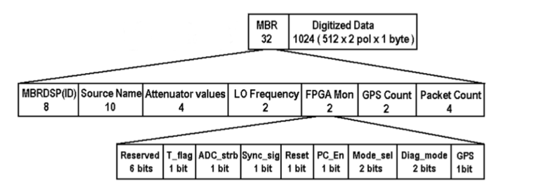
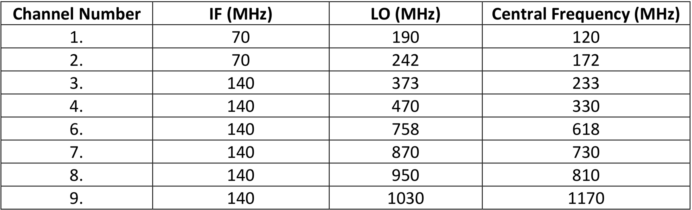
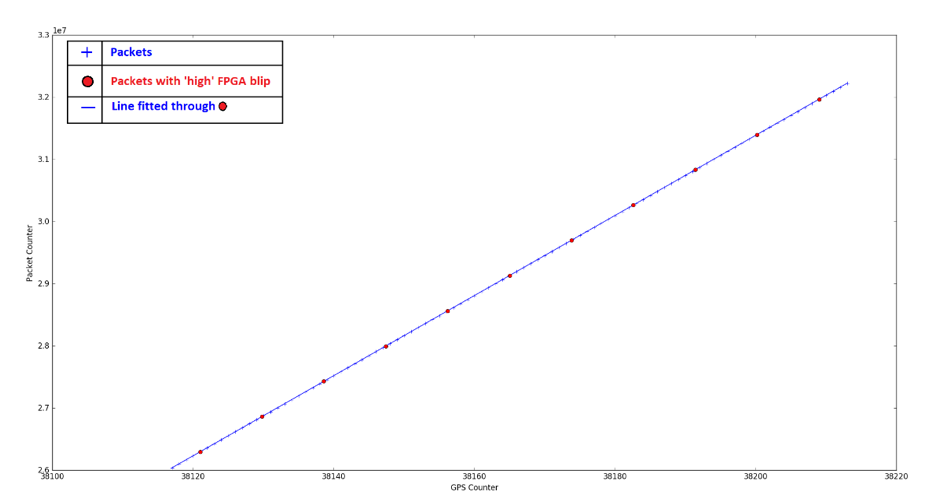

# Pulsar Analysis Package
```
Author      : Hrishikesh Shetgaokar(hrishikesh036@gmail.com)
Guide       : Prof. Avinash Deshpande
Co-Guide    : Dr. Kaushar Vaidya
Institute   : BITS Pilani, Pilani Campus & Raman Research Institue 
Reviewers   : Akhil Jaini, Aleena Baby
```

## Description:

This package was developed during my time at Raman Research Institute while working
with Prof Avinash Deshpande (*'desh'*). This is an attempt to systematically refactor
the highly inefficient and unreadable code which I had written during my naive days.

The objective of the 4 month thesis project was to study the radio emissions of a drifter
pulsar at different bands to better understand the magnetosphere. More information can be found 
in my Thesis Report ([Drifting_Subpulse_Thesis.pdf](Drifting_Subpulse_Thesis.pdf))

The idea here is to use OOPs to build a simple data processing tool for pulsar data.

## Table of Contents
1. [MBR to Dynamic Spectrum](#1-mbr-to-dynamic-spectrum)
      * [Step 1: Packet Level Synchronization](#step-1-packet-level-synchronization)
2. [Dynamic Spectrum to Time Series](#2-dynamic-spectrum-to-time-series)


## 1. MBR to Dynamic Spectrum
The multi frequency data were recorded using RRI-GBT Multi-Band Receiver (MBR). The time varying voltage data from the 
MBR along with a header are saved in '.mbr' files.
These '.mbr' data files are to be placed in [MBRData directory](MBRData) channel wise (as shown below) for processing.

<ins>MBRData</ins>  
  |--> ch01  
  |--> ch02  
  |--> ch03  
  |--> ch04  
  ...

The '.mbr' file name should be of the form "ch01_B0834+06_20090725_114903_000.mbr" where:
* First 4 characters (ch01) tell the channel number
* Next 8 characters (B0834+06) tell the pulsar name 
* Next 15 characters (20090725_114903) tell the date and time of observation (2009/07/25 11:49:03)
* Last characters tell the sequence number

Each mbr data file is made up of 2,027,520 mbr packets. The mbr packet is 1056 bytes long. 
The first 32 bytes in mbr packet is the header which stores information like Observation ID, Source Name, Local Oscillator 
(LO) frequency, GPS count, packet count, etc. and the structure of its header is shown in Figure 1.1. The 1024 bytes after the 
header contain raw voltage data sampled at 33 MHz. Of these 1024, 512 bytes are for X polarization and Y polarization each.

<p align="center">
  
</p>
<p align="center">
  <a>Figure 1.1: MBR packet header</a>
  <br><br>
</p>

Each observation band is 16 MHz wide and the central frequency of this band can be calculated from LO frequency by using 
the formula RF = LO ± IF. Of these two values select the one which lies in the band. The LO, IF and resulting RF (central 
frequency) values obtained for 8 channels is given in Table 1.1
<p align="center">
  
</p>
<p align="center">
  <a>Table 1.1: Central Frequency for channels</a>
  <br><br>
</p>

The recorded data also suffer from missing packets. These missing packets can be considered as bad data and are flagged 
(given a value -9999 in dynamic spectrum) so that they can be avoided while calculating time sequence. 
The missing packets were detected by keeping a count of number of packets read and comparing that to the packet number 
present in the header of current packet being read.

#### Step 1: Packet Level Synchronization
For analysing signals received across all 10 frequency bands, it is extremely important that we synchronize the data 
from each band. This would ensure that we compare and study pulse signals from different channels having the same origin
at the pulsar.

For this, the header of each packet is analysed and the GPS count, packet number and GPS pulse for each packet is recorded. 
GPS count is the number of seconds after 00:00hrs on the day of observation. The count is updated every second. GPS pulse 
is a very short (nano seconds) pulse. If this pulse is ‘high’ while writing the header, 1 is recorded in the GPS bit. Else 
zero is recorded. Plot the GPS count vs Packet Number for all packets and fit a line through those with ‘high’ GPS bit. 
Let us call this line ‘A’. Refer Fig 1.2

<p align="center">
  
</p>
<p align="center">
  <a>Table 1.2: GPS counts vs Packet Number</a>
  <br><br>
  <a>The packet with ‘high’ GPS pulse in header is marked in red</a>
  <br><br>
</p>

Such analysis is done for all 9 channels. Now taking the first occurrence of GPS count as a reference start for our 
observation, note the corresponding packet number on the line ‘A’ for all channels. Treat this packet number as the 
first packet for our observations in all corresponding channels.

The synchronization code used is present in [synchronization_all.py](AnalysisPackages/synchronization/synchronization_all.py).
This code calculates first packet of synchronization for all channels and populate the data in 
[ChannelVsFirstPacket_\*PSRDetails\*.txt](AnalysisPackages/resources/ChannelVsFirstPacket_B0834+06_20090725_114903.txt).
This code internally calls [synchronization_single.py](AnalysisPackages/synchronization/synchronization_single.py) which calculates the 
same for only one channel.

For the code to run properly, MBR data files should be present channel wise in [MBRData](MBRData) directory.
It accepts mbr file name details without the sequence number as input command line argument.
Example command to run from project root for mbr data B0834+06_20090725_114903:
```
python3 -m AnalysisPackages.synchronization.synchronization_all B0834+06_20090725_114903
```
Output:
Channel number and first packet of synchronization for all channels is saved in the path:
[ChannelVsFirstPacket_\*PSRDetails\*.txt](AnalysisPackages/resources/ChannelVsFirstPacket_B0834+06_20090725_114903.txt)
(AnalysisPackages/resources/ChannelVsFirstPacket_B0834+06_20090725_114903.txt)


## 2. Dynamic Spectrum to Time Series 
