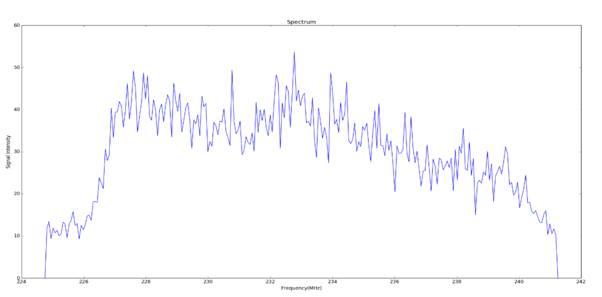
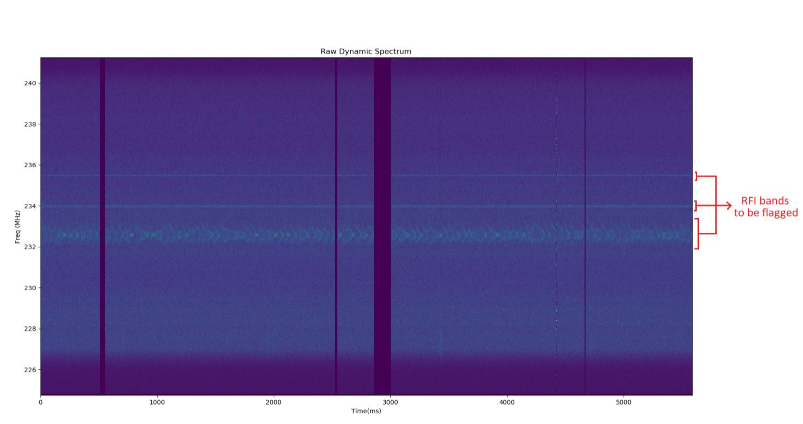

# Pulsar Analysis Package
```
Author      : Hrishikesh Shetgaokar(hrishikesh036@gmail.com)
Guide       : Prof. Avinash Deshpande
Co-Guide    : Dr. Kaushar Vaidya
Institute   : BITS Pilani, Pilani Campus & Raman Research Institue 
Reviewers   : Akhil Jaini, Aleena Baby
```

## Description:

This package was developed during my time at Raman Research Institute while working
with Prof Avinash Deshpande (*'desh'*). This is an attempt to systematically refactor
the highly inefficient and unreadable code which I had written during my naive days.

The objective of the 4 month thesis project was to study the radio emissions of a drifter
pulsar at different bands to better understand the magnetosphere. More information can be found 
in my Thesis Report ([Drifting_Subpulse_Thesis.pdf](Drifting_Subpulse_Thesis.pdf))

The idea here is to use OOPs to build a simple data processing tool for pulsar data.

## Table of Contents
1. [MBR data](#1-mbr-data)
2. [Packet Level Synchronization](#2-packet-level-synchronization)
3. [Pulsar Information Utility](#3-pulsar-information-utility)
4. [MBR to Dynamic Spectrum](#4-mbr-to-dynamic-spectrum)
5. [Dynamic Spectrum to Time Series](#5-dynamic-spectrum-to-time-series)

## 1. MBR Data
The multi frequency data were recorded using RRI-GBT Multi-Band Receiver (MBR). The time varying voltage data from the 
MBR along with a header are saved in '.mbr' files.
These '.mbr' data files are to be placed in [MBRData directory](MBRData) channel wise (as shown below) for processing.

<ins>MBRData</ins>  
  |--> ch01  
  |--> ch02  
  |--> ch03  
  |--> ch04  
  ...

The '.mbr' file name should be of the form "ch01_B0834+06_20090725_114903_000.mbr" where:
* First 4 characters (ch01) tell the channel number
* Next 8 characters (B0834+06) tell the pulsar name 
* Next 15 characters (20090725_114903) tell the date and time of observation (2009/07/25 11:49:03)
* Last characters tell the sequence number

Each mbr data file is made up of 2,027,520 mbr packets. The mbr packet is 1056 bytes long. 
The first 32 bytes in mbr packet is the header which stores information like Observation ID, Source Name, Local Oscillator 
(LO) frequency, GPS count, packet count, etc. and the structure of its header is shown in Figure 1.1. The 1024 bytes after the 
header contain raw voltage data sampled at 33 MHz. Of these 1024, 512 bytes are for X polarization and Y polarization each.

<p align="center">
  
</p>
<p align="center">
  <a>Figure 1.1: MBR packet header</a>
  <br><br>
</p>

Each observation band is 16 MHz wide and the central frequency of this band can be calculated from LO frequency by using 
the formula RF = LO ± IF. Of these two values select the one which lies in the band. The LO, IF and resulting RF (central 
frequency) values obtained for 8 channels is given in Table 1.1
<p align="center">
  
</p>
<p align="center">
  <a>Table 1.1: Central Frequency for channels</a>
  <br><br>
</p>

The recorded data also suffer from missing packets. These missing packets can be considered as bad data and are flagged 
(given a value np.nan in the dynamic spectrum) so that they can be avoided while calculating time sequence. 
The missing packets were detected by keeping a count of number of packets read and comparing that to the packet number 
present in the header of current packet being read.

## 2. Packet Level Synchronization
For analysing signals received across all 10 frequency bands, it is extremely important that we synchronize the data 
from each band. This would ensure that we compare and study pulse signals from different channels having the same origin
at the pulsar.

For this, the header of each packet is analysed and the GPS count, packet number and GPS pulse for each packet is recorded. 
GPS count is the number of seconds after 00:00hrs on the day of observation. The count is updated every second. GPS pulse 
is a very short (nano seconds) pulse. If this pulse is ‘high’ while writing the header, 1 is recorded in the GPS bit. Else 
zero is recorded. Plot the GPS count vs Packet Number for all packets and fit a line through those with ‘high’ GPS bit. 
Let us call this line ‘A’. Refer Fig 1.2

<p align="center">
  
</p>
<p align="center">
  <a>Table 1.2: GPS counts vs Packet Number</a>
  <br><br>
  <a>The packet with ‘high’ GPS pulse in header is marked in red</a>
  <br><br>
</p>

Such analysis is done for all 9 channels. Now taking the first occurrence of GPS count as a reference start for our 
observation, note the corresponding packet number on the line ‘A’ for all channels. Treat this packet number as the 
first packet for our observations in all corresponding channels.

The synchronization code used is present in [synchronization_all.py](AnalysisPackages/synchronization/synchronization_all.py).
This code calculates first packet of synchronization for all channels and populate the data in 
[ChannelVsFirstPacket_\*PSRDetails\*.txt](AnalysisPackages/resources/ChannelVsFirstPacket_B0834+06_20090725_114903.txt).
This code internally calls [synchronization_single.py](AnalysisPackages/synchronization/synchronization_single.py) which calculates the 
same for only one channel.

For the code to run properly, MBR data files should be present channel wise in [MBRData](MBRData) directory.
It accepts mbr file name details without the sequence number as input command line argument.
Example command to run from project root for mbr data B0834+06_20090725_114903:
```
python3 -m AnalysisPackages.synchronization.synchronization_all B0834+06_20090725_114903
```
Output:
Channel number and first packet of synchronization for all channels is saved in the path:
[ChannelVsFirstPacket_\*PSRDetails\*.txt](AnalysisPackages/resources/ChannelVsFirstPacket_B0834+06_20090725_114903.txt)
(AnalysisPackages/resources/ChannelVsFirstPacket_B0834+06_20090725_114903.txt)

## 3. Pulsar Information Utility
Idea behind this utility is to have a class which can be used to hold all configuration parameters and pulsar properties 
at a single place. This class also has methods to populate the following band specific observation properties in 
[config.txt](AnalysisPackages/resources/config.txt):
* Central frequency
* Sampling frequency
* First packet for synchronization
* Dispersion delay(in terms of number of packets) for synchronization

Usage: 
Make sure that the [config.txt](AnalysisPackages/resources/config.txt) file is present in correct resources 
directory((AnalysisPackages/resources/)). It accepts mbr file name details without the sequence number as 
input command line argument. Example command to run from project root for mbr data B0834+06_20090725_114903:
```
python3 -m AnalysisPackages.utilities.pulsar_information_utility B0834+06_20090725_114903
```
There'll be a prompt to choose a option to populate config.txt.
```
1. Populate central frequency for all bands in config.txt
2. Populate sampling frequency and first packet for all bands in config.txt
3. Populate packets to skip for dispersion delay synchronization across bands in config.txt
4. Do all
5. Exit(enter Q or 5)
```
Choose a desired option by entering corresponding option value(1,2,3,4,5,Q or q)
## 4. MBR to Dynamic Spectrum 
A Dynamic spectrum is simply intensity as a function of frequency and time. It can be constructed by calculating the 
spectrum (intensity as a function of frequency) at different times. To calculate the spectrum, we take Fast Fourier Transform (FFT) 
of 512 samples each in X polarization and Y polarization. Let X and Y be the resulting spectrum for x and y polarization. 
Intensity spectrum for x polarization can be calculated as (X.X'), where X' denotes complex conjugate of X. Similarly, 
intensity spectrum for y polarization can be calculated as (Y.Y'). Note that the intensity spectrum has 256 channels.
The resulting intensity spectrum (Figure 4.1) forms a column of the dynamic spectrum (Figure 4.2) with each column (i.e., spectrum) 
taken at successive time intervals. Also note that the entire bandwidth of 16MHz is divided into 256 channels. 
So, each channel is 6.25 KHz wide. We also calculate cross spectrum as (X.Y'). 

<p align="center">
  
</p>
<p align="center">
  <a>Figure 4.1: Intensity spectrum</a>
  <br><br>
</p>

<p align="center">
  
</p>
<p align="center">
  <a>Figure 4.1: Dynamic Spectrum</a>
  <br><br>
</p>

Obtaining dynamic spectrum for a particular sequence of .mbr files is done in [mbr2dynamicspectrum.py](AnalysisPackages/mbr/mbr2dynamicspectrum.py).
Performs the following tasks:
1) Reads properties from [config.txt](AnalysisPackages/resources/config.txt)
2) Divides single mbr file into n parts(specified in [config.txt](AnalysisPackages/resources/config.txt))  for processing
3) Computes the intensity dynamic spectra for X.conjugate(X), Y.conjugate(Y), real(X.conjugate(Y)) and imaginary(X.conjugate(Y))
    where X and Y correspond to spectra for X polarization and Y polarization respectively.
    More clarity can be found in section 3.3 in [Drifting_Subpulse_Thesis.pdf](Drifting_Subpulse_Thesis.pdf)
4) Saves these 4 dynamic spectra as .spec files in [output directory](OutputData) channel wise. For example, the .spec data for 
    mbr sequence "ch03_B0834+06_20090725_114903" will be saved in path: OutputData/B0834+06_20090725_114903/DynamicSpectrum/ch03/

Usage:
Run the following command to view help on all optional command line arguments
```
python3 -m AnalysisPackages.mbr.mbr2dynamicspectrum -h
```
Output describes how to use the command:
```
usage: mbr2dynamicspectrum.py input_file_name [-h] [-s] [-plotXX] [-plotYY] [-plotRealXY] [-plotImagXY] [-psrUtil] [-t]

positional arguments(necessary arguments):
  Argument:             Functionality:
  file_name             The mbr filename without the sequence number(eg. ch03_B0834+06_20090725_114903)

optional arguments:
  Arguments:            Functionality:
  -h, --help            show this help message and exit
  -s, --packetSynch     Do packet level synchronization across bands
  -plotXX, --plotXX     plot dynamic spectrum for X polarization after processing each part of mbr file
  -plotYY, --plotYY     plot dynamic spectrum for Y polarization after processing each part of mbr file
  -plotRealXY, --plotRealXY
                        plot dynamic spectrum for real part of cross (X.Conjugate(Y)) after processing each part of mbr file
  -plotImagXY, --plotImagXY
                        plot dynamic spectrum for imaginary part of cross (X.Conjugate(Y)) after processing each part of mbr file
  -psrUtil, --psrUtil   run pulsar_information_utility for populating the config file before computing the dynamic spectra
  -t, --timer           print time taken to process each part of mbr file

```
Not passing the optional argument will simply not execute the corresponding functionality.

In most cases, we will run:
```
python3 -m AnalysisPackages.mbr.mbr2dynamicspectrum ch03_B0834+06_20090725_114903
```

For obtaining the dynamic spectrum with packet level synchronization across all bands we use teh following command. 
Apart from the synchronization mentioned in [Section 2](#2-packet-level-synchronization), this synchronization also includes 
synchronization to compensate for dispersion delay across bands:
```
python3 -m AnalysisPackages.mbr.mbr2dynamicspectrum ch03_B0834+06_20090725_114903 -packetSynch
```

All optional parameters set to true:
```
python3 -m AnalysisPackages.mbr.mbr2dynamicspectrum ch03_B0834+06_20090725_114903 -packetSynch -plotXX -plotYY -plotRealXY -plotImagXY -runPsrUtility -psrUtil
```

Note:

Setting the optional plotting parameters (-plotXX, -plotYY, -plotRealXY or -plotImagXY) will plot the selected dynamic spectra
after processing each part of mbr file. After this, the program will ask during runtime whether to continue plotting for subsequent parts(Y) or not(n). 
The default is 'n'. That is, if a 'Y' is not provided, plotting will be suspended for subsequent parts.
## 5. Dynamic Spectrum to Time Series 
